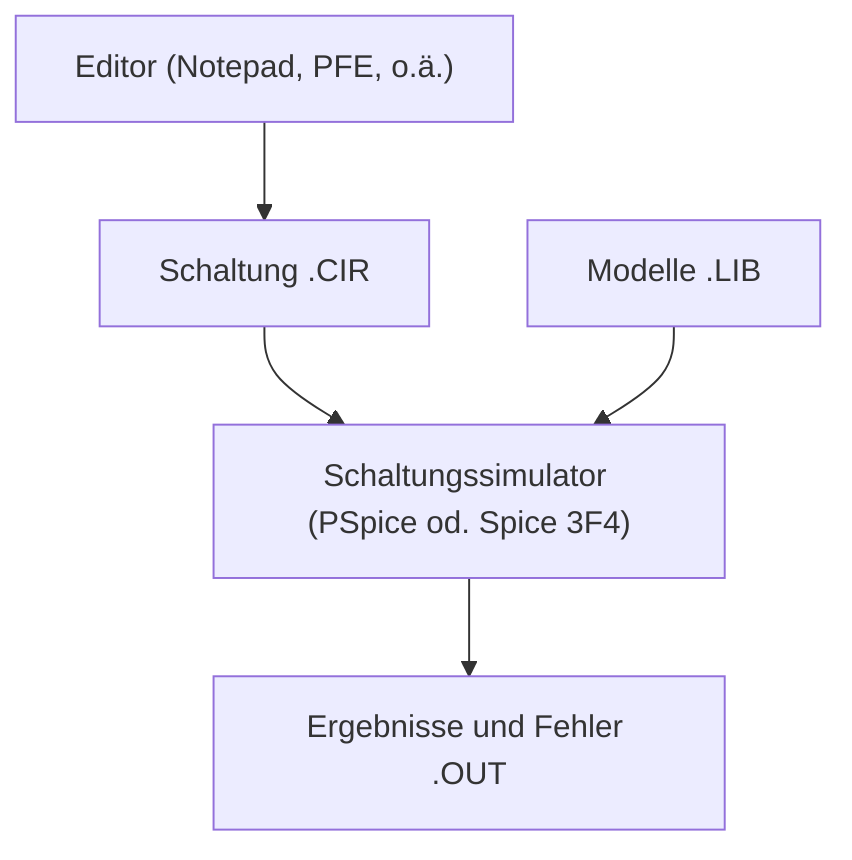
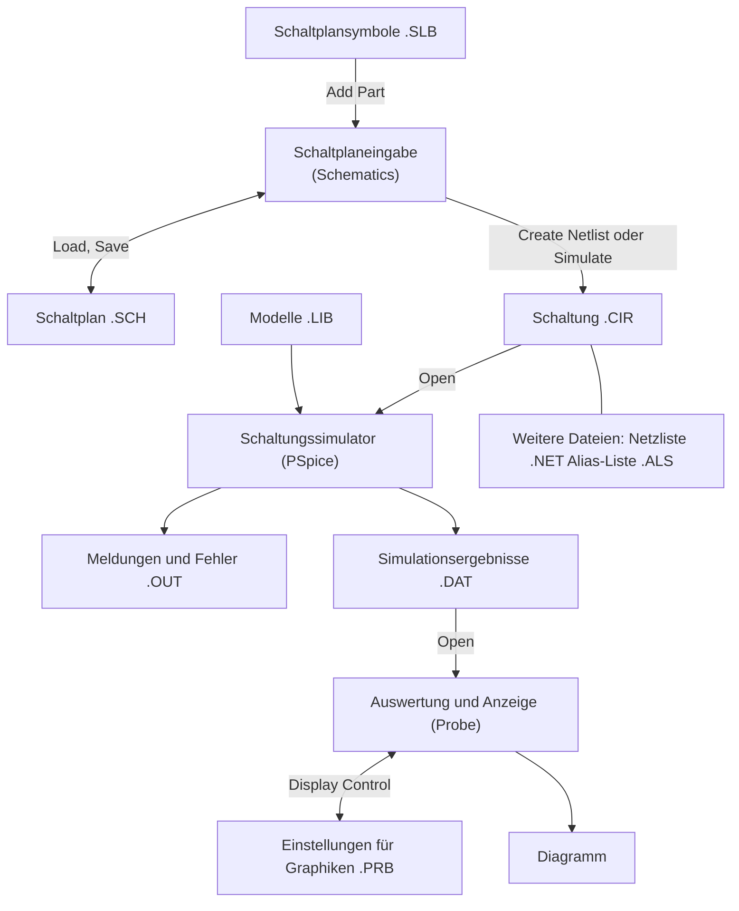

### 28.1.1 Grundsätzliches

*PSpice* von *Cadence* (früher *MicroSim*) ist ein Schaltungssimulator der *Spice*-Familie (*Simulation Program with Integrated Circuit Emphasis*) zur Simulation analoger, digitaler und gemischt analog-digitaler Schaltungen. *Spice* wurde um 1970 an der Universität in Berkeley entwickelt und existiert heute in der Version 3F4 zur lizenzfreien Verwendung. Auf dieser Basis wurden kommerzielle Ableger entwickelt, die spezifische Erweiterungen und zusätzliche Module zur grafischen Schaltplan-Eingabe, Ergebnisanzeige und Ablaufsteuerung enthalten. Bekannte Ableger sind *PSpice* und *HSpice*. Während *HSpice* von *Synopsys* für den Entwurf integrierter Schaltungen mit mehreren Tausend Transistoren ausgelegt ist und in vielen IC-Design-Paketen als Simulator verwendet wird, ist *PSpice* ein besonders preisgünstiges und komfortabel zu bedienendes Programmsystem zum Entwurf kleiner und mittlerer Schaltungen auf PCs mit Windows-Betriebssystem.

Die vorliegende Kurzanleitung basiert auf der Evaluation-Version von *PSpice* 8, die unter *www.tietze-schenk.de* verfügbar ist.

### 28.1.2 Programme und Dateien

#### 28.1.2.1 Spice

Alle Simulatoren der *Spice*-Familie arbeiten mit Netzlisten. Eine Netzliste ist eine mit einem Editor erstellte Beschreibung einer Schaltung, die neben den Bauteilen und Angaben zur Schaltungstopologie Simulationsanweisungen und Verweise auf Bibliotheken mit Modellen enthält. Abb. 28.1.1 zeigt den Ablauf einer Schaltungssimulation mit den beteiligten Programmen und Dateien:

- Die Netzliste der zu simulierenden Schaltung wird mit einem Editor erstellt und in der Schaltungsdatei `<name>.CIR` (*CIRcuit*) gespeichert.
- Der Simulator (*PSpice* oder *Spice 3F4*) liest die Schaltung ein und führt die Simulation entsprechend den Simulationsanweisungen durch; dabei werden ggf. Modelle aus Bauteile-Bibliotheken `<xxx>.LIB` (*LIBrary*) verwendet.
- Simulationsergebnisse und (Fehler-) Meldungen werden in der Ausgabedatei `<name>.OUT` (*OUTput*) abgelegt und können mit einem Editor angezeigt und ausgedruckt werden.

#### 28.1.2.2 PSpice

Das *PSpice*-Paket enthält neben dem Simulator *PSpice* ein Programm zur grafischen Schaltplan-Eingabe (*Schematics*) und ein Programm zur grafischen Anzeige der Simulationsergebnisse (*Probe*). Abb. 28.1.2 zeigt den Ablauf mit den beteiligten Programmen und Dateien:

- Mit dem Programm *Schematics* wird der Schaltplan der zu simulierenden Schaltung eingegeben und in der Schaltplandatei `<name>.SCH` (*SCHematic*) gespeichert; dabei werden Schaltplansymbole aus Symbol-Bibliotheken `<xxx>.SLB` (*Schematic LiBrary*) verwendet.

**Programme und Dateien bei *Spice***


- Im Programm *Schematics* wird durch Starten der Simulation (*Analysis/ Simulate*) oder durch Erzeugen der Netzliste (*Analysis/Create Netlist*) die Schaltungsdatei <name>.CIR erzeugt; dabei wird die Netzliste in der Datei <name>.NET gespeichert und mit einer *Include*-Anweisung eingebunden. Als weitere Datei wird <name>.ALS erzeugt; diese Datei enthält eine Liste mit Alias-Namen und ist für den Anwender unbedeutend.
- *PSpice* wird durch Starten der Simulation (*Analysis/Simulate*) im Programm *Schematics* gestartet; alternativ kann man *PSpice* manuell starten und mit *File/Open* die Schaltungsdatei auswählen. Bei der Simulation werden Modelle aus Bauteile-Bibliotheken <xxx>.LIB verwendet.
- Die graphisch darstellbaren Simulationsergebnisse werden in der Datendatei <name>.DAT gespeichert; nichtgraphische Ergebnisse und Meldungen werden in der Ausgabedatei <name>.OUT abgelegt und können mit einem Editor angezeigt werden.
- Mit dem Programm *Probe* können die Simulationsergebnisse grafisch dargestellt werden; dabei kann man die einzelnen Signale direkt darstellen oder Berechnungen mit einem oder mehreren Signalen durchführen. Die zum Aufbau einer Grafik erforderlichen Befehle können mit der Funktion *Options/Display Control* in der Anzeigedatei <name>.PRB gespeichert und wieder abgerufen werden. Wenn die Simulation im Programm *Schematics* mit *Analysis/Simulate* gestartet wurde, wird *Probe* am Ende der Simulation automatisch gestartet; die Datendatei <name>.DAT wird in diesem Fall automatisch geladen. Bei manuellem Start muss man die Datendatei mit *File/Open* auswählen.

## PSpice-Kurzanleitung



**Abb. 28.1.2.** Programme und Dateien bei *PSpice*

Man kann auch bei *PSpice* direkt mit Netzlisten arbeiten, indem man auf die grafische Schaltplan-Eingabe verzichtet und die Schaltungsdatei `<name>.CIR` mit einem Editor erstellt. Man hat dann im Vergleich zu *Spice* immer noch den Vorteil der grafischen Darstellung der Simulationsergebnisse mit *Probe*. Diese Arbeitsweise wird oft bei der Erstellung von neuen Modellen verwendet, da ein erfahrener Anwender Fehler, die beim Testen eines Modells auftreten, in der Schaltungsdatei schneller beheben kann als über die grafische Schaltplan-Eingabe.

### Beispiel

Die Eingabe einer Schaltung und die Durchführung einer Simulation werden am Beispiel eines Kleinsignal-Verstärkers mit Wechselspannungskopplung gezeigt; Abb. 28.1.3 zeigt den Schaltplan.

#### Eingabe des Schaltplans

Zur Schaltplan-Eingabe wird das Programm *Schematics* gestartet; Abb. 28.1.4 zeigt das Programmfenster. Die Werkzeugleiste enthält von links beginnend die *File*-Operationen *New, Open, Save* und *Print*, die *Edit*-Operationen *Cut, Copy, Paste, Undo* und *Redo* und die *Draw*-Operationen *Redraw, Zoom In, Zoom Out, Zoom Area* und *Zoom to Fit Page*, die alle in der gewohnten Art arbeiten.

Die Schaltplan-Eingabe wird schrittweise vorgenommen:

- Bauteile einfügen;
- Bauteile konfigurieren;
- Verbindungsleitungen einfügen.

![[Pasted image 20260419190457.png]]

```cir
* Common-emitter amplifier
* Nodes:
* ub   = +15 V supply rail
* ein  = amplifier input after source resistor
* b    = transistor base
* aus  = amplifier output / collector
* e    = upper emitter node
* e1   = lower emitter node
* 0    = ground

VUB ub 0 DC 15
VUG vin 0 SIN(0 0.2 1k)
RG vin ein 50
C1 ein b 22u

R1 ub b 75k
R2 b 0 18k

R3 ub aus 39k
Q1 aus b e BC547B

R4 e e1 4.7k
R5 e1 0 5.6k
C2 e1 0 3.3u

CP aus 0 4p

* Approximate BC547B model for simulation when no vendor model is available
.model BC547B NPN (
+ IS=1.16E-14
+ BF=416.4
+ NF=0.993
+ VAF=97.2
+ IKF=0.135
+ ISE=2.07E-14
+ NE=1.65
+ BR=10.0
+ NR=1.0
+ VAR=24.4
+ IKR=0.03
+ ISC=0
+ NC=2
+ RB=280
+ RE=0.6
+ RC=0.25
+ CJE=2.17E-11
+ VJE=0.75
+ MJE=0.33
+ TF=4.26E-10
+ XTF=80
+ VTF=4
+ ITF=0.4
+ CJC=6.59E-12
+ VJC=0.54
+ MJC=0.37
+ XCJC=0.945
+ TR=1.0E-7
)

.op
.ac dec 100 10 10Meg
.tran 0 10m 0 1u
.probe V(ein) V(b) V(aus) V(e) V(e1)

.end
```

Dazu werden folgende Werkzeuge benötigt:

| Schritt | Werkzeug          | Aktion                          |
| ------- | ----------------- | ------------------------------- |
| 1       | *Get New Part*    | Bauteil einfügen                |
| 2       | *Edit Attributes* | Bauteil konfigurieren           |
| 3       | *Draw Wire*       | Verbindungsleitung einfügen     |
| 4       | *Setup Analysis*  | Simulationsanweisungen eingeben |
| 5       | *Simulate*        | Simulation starten              |

##### Bauteile einfügen

Mit dem Werkzeug *Get New Part* wird das Dialog-Fenster *Part Browser Basic* aufgerufen; mit der Funktion *Advanced* erhält man das in Abb. 28.1.5 gezeigte Dialog-Fenster *Part Browser Advanced*. Ist der Name des Bauteils bekannt, kann er im Feld *Part Name* eingegeben werden; das Bauteil erscheint in der Vorschau und kann mit *Place* oder *Place & Close* übernommen werden. Ist der Name nicht bekannt, muss man die Liste der Bauteile durchsuchen. Mit der Funktion *Libraries* kann man ein Dialog-Fenster aufrufen, in dem die Bauteile nach Bibliotheken getrennt angezeigt werden; eine Vorschau erfolgt hier jedoch erst nach erfolgter Auswahl und Rücksprung mit *Ok*.

Nach Übernahme mit *Place* oder *Place & Close* wird das Bauteil durch Betätigen der linken Maustaste im Schaltplan eingefügt. Vor dem Einfügen kann man das Bauteil mit *Strg-R* rotieren und mit *Strg-F* spiegeln. Der Einfügemodus bleibt erhalten, bis die rechte Maustaste oder *Esc* betätigt wird.

Die Namen der wichtigsten passiven und aktiven Bauteile lauten:

| Name        | Bauteil                             | Bibliothek     |
| ----------- | ----------------------------------- | -------------- |
| R           | Widerstand                          | TS_ANALOG.SLB  |
| C           | Kapazität                           | ^^             |
| L           | Induktivität                        | ^^             |
| K           | induktive Kopplung                  | ^^             |
| E           | spannungsgesteuerte Spannungsquelle | ^^             |
| F           | stromgesteuerte Stromquelle         | ^^             |
| G           | spannungsgesteuerte Stromquelle     | ^^             |
| H           | stromgesteuerte Spannungsquelle     | ^^             |
| Uebertrager | idealer Übertrager                  | ^^             |
| U           | allgemeine Spannungsquelle          | ^^             |
| Ub          | Gleichspannungsquelle               | ^^             |
| U-Dreieck   | Großsignal-Dreieckspannungsquelle   | ^^             |
| U-Puls      | Großsignal-Pulsspannungsquelle      | ^^             |
| U-Rechteck  | Großsignal-Rechteckspannungsquelle  | ^^             |
| U-Sinus     | Großsignal-Sinusspannungsquelle     | ^^             |
| I           | allgemeine Stromquelle              | ^^             |
| Ib          | Gleichstromquelle                   | ^^             |
| GND         | Masse                               | ^^             |
| 1N4148      | Kleinsignal-Diode 1N4148 (100 mA)   | TS_BIPOLAR.SLB |
| 1N4001      | Gleichrichter-Diode 1N4001 (1 A)    | ^^             |
| BAS40       | Kleinsignal-Schottky-Diode BAS40    | ^^             |
| BC547B      | npn-Kleinsignal-Transistor BC547B   | ^^             |
| BC557B      | pnp-Kleinsignal-Transistor BC557B   | ^^             |
| BD239       | npn-Leistungs-Transistor BD239      | ^^             |
| BD240       | pnp-Leistungs-Transistor BD240      | ^^             |
| BF245B      | n-Kanal-Sperrschicht-Fet BF245B     | TS_FET.SLB     |
| IRF142      | n-Kanal-Leistungs-Mosfet IRF142     | ^^             |
| IRF9142     | p-Kanal-Leistungs-Mosfet IRF9142    | ^^             |

##### Bauteile konfigurieren

Die meisten Bauteile müssen nach dem Einfügen noch konfiguriert werden. Darunter versteht man bei passiven Bauteilen wie Widerständen, Kapazitäten und Induktivitäten die Angabe des Wertes (Value), bei Spannungs- und Stromquellen die Angabe der Signalform mit den zugehörigen Parametern (Amplitude, Frequenz, usw.) und bei gesteuerten Quellen die Angabe des Steuerfaktors. Halbleiterbauelemente wie Transistoren oder Operationsverstärker müssen nicht konfiguriert werden, da sie einen Verweis auf ein Modell in einer Modell-Bibliothek enthalten, das alle Angaben enthält.

Den Wert eines passiven Bauelements kann man durch einen Maus-Doppelklick auf den angezeigten Wert ändern; dabei erscheint ein Dialog-Fenster Set Attribute Value zur Eingabe des Wertes, siehe Abb. 28.1.6.

Über das Werkzeug Edit Attributes oder durch einen Maus-Doppelklick auf das Symbol des Bauteils erhält man das in Abb. 28.1.7 gezeigte Dialog-Fenster Part, in dem alle Parameter anzeigt werden. Parameter, die nicht mit einem Stern gekennzeichnet sind, können ausgewählt, im Feld Value geändert und mit Save Attr gespeichert werden. Mit der Funktion Change Display kann man einstellen, ob und wie der ausgewählte Parameter im Schaltplan angezeigt wird; meistens wird nur der Wert, z.B. $1k$, oder der Parametername und der Wert, z.B. $R = 1k$, angezeigt.

**Abb. 28.1.7.**  
Dialog *Part*

Zahlenwerte können in exponentieller Form, z.B. 1.5E-3 (beachte: Dezimalpunkt, kein Komma !), oder mit den folgenden Suffixen angegeben werden:

| Suffix | f | p | n | u | m | k | Mega | G | T |
|---|---|---|---|---|---|---|---|---|---|
| Name | Femto | Piko | Nano | Mikro | Milli | Kilo | Mega | Giga | Tera |
| Wert | $10^{-15}$ | $10^{-12}$ | $10^{-9}$ | $10^{-6}$ | $10^{-3}$ | $10^{3}$ | $10^{6}$ | $10^{9}$ | $10^{12}$ |

Es wird nicht zwischen Groß- und Kleinschreibung unterschieden. Ein häufig auftretender Fehler ist die Verwendung von M für *Mega*, was üblich ist, aber von *PSpice* als *Milli* interpretiert wird.

##### Verbindungsleitungen einfügen

Nachdem alle Bauteile der Schaltung eingefügt und konfiguriert sind, müssen mit dem Werkzeug *Draw Wire* die Verbindungsleitungen eingegeben werden; dabei wird anstelle des Mauszeigers ein Stift angezeigt. Zunächst muss man den Anfangspunkt einer Leitung durch Betätigen der linken Maustaste markieren. Der Verlauf der Leitung wird als gestrichelte Linie angezeigt und kann mit der linken Maustaste punktweise bis zum Endpunkt eingegeben werden, siehe Abb. 28.1.8. Im einfachsten Fall wird nur der Anfangs- und der Endpunkt eingegeben; in diesem Fall wird der Verlauf automatisch gewählt. Durch setzen von Zwischenpunkten kann man den Verlauf beeinflussen. Wird ein Punkt auf den Anschluss eines Bauteils oder auf eine andere Leitung gesetzt, wird die Leitung als vollständig betrachtet und die Eingabe beendet. Alternativ kann man die Eingabe durch Betätigen der rechten Maustaste oder *Esc* an jeder beliebigen Stelle beenden.

Masseleitungen werden normalerweise nicht gezeichnet; statt dessen wird an jedem Punkt, der mit Masse verbunden ist, das Masse-Symbol GND angeschlossen. Die Masse wird in der Netzliste mit dem Knoten-Namen 0 bezeichnet, die Bestandteil von GND ist. Es muss immer ein Knoten 0 vorhanden sein; deshalb muss jeder Schaltplan mindestens ein Masse-Symbol enthalten.

Alle Knoten erhalten automatisch einen Namen zugewiesen, der in der Netzliste erscheint und im Anzeigeprogramm *Probe* zur Auswahl der anzuzeigenden Signal benötigt

**Abb. 28.1.8.**  
Einfügen einer Verbindungsleitung

**Abb. 28.1.9.** Vollständiger Schaltplan für das Beispiel

wird. Da die automatisch vergebenen Namen nicht im Schaltplan erscheinen und deshalb ohne Auswertung der Netzliste nicht bekannt sind, sollte man im Schaltplan für jeden interessierenden Knoten einen sprechenden Namen angeben; dazu führt man einen Doppelklick auf eine zu diesem Knoten gehörende Leitung aus und gibt den Namen ein.

Nach dem Einfügen und Konfigurieren aller Bauteile, dem Einfügen aller Verbindungsleitungen und der Eingabe der Knoten-Namen erhält man den Schaltplan nach Abb. 28.1.9; er wird, falls noch nicht erfolgt, mit *File/Save* gespeichert.

#### Simulationsanweisungen eingeben

In diesem Schritt werden die durchzuführenden Simulationen und die Parameter der zur Ansteuerung verwendeten Spannungs- und Stromquellen angegeben. Es gibt drei Simulationsmethoden, die mit unterschiedlichen Quellen arbeiten:

- *Gleichspannungsanalyse (DC Sweep):* Mit dieser Analyse wird das Gleichspannungsverhalten einer Schaltung untersucht; dabei werden eine oder zwei Quellen variiert. Als Ergebnisse erhält man eine Kennlinie oder ein Kennlinienfeld. Bei dieser Analyse werden nur Gleichspannungsquellen und die Gleichanteile aller anderen Quellen (Parameter $DC$=) berücksichtigt.

**Abb. 28.1.10.** Parameter der Quelle zur Ansteuerung der Schaltung

– *Kleinsignalanalyse (AC Sweep):* Mit dieser Analyse wird das Kleinsignalverhalten untersucht. Zunächst wird mit Hilfe der Gleichspannungsquellen bzw. Gleichanteile der Arbeitspunkt der Schaltung ermittelt; in diesem Arbeitspunkt wird die Schaltung linearisiert. Anschließend wird mit Hilfe der komplexen Wechselstromrechnung das Übertragungsverhalten bei Variation der Frequenz ermittelt. In diesem zweiten Schritt werden nur die Kleinsignalanteile der Quellen (Parameter $AC =$) berücksichtigt. Da die Kleinsignalanalyse linear ist, hängt das Ergebnis linear von den angegebenen Amplituden ab; man verwendet deshalb meist eine normierte Amplitude von 1 V bzw. 1 A, d.h. $AC = 1$.

– *Großsignalanalyse (Transient):* Mit dieser Analyse wird das Großsignalverhalten untersucht; dabei wird der zeitliche Verlauf aller Spannungen und Ströme durch numerische Integration ermittelt. Bei dieser Analyse werden nur Großsignalquellen und die Großsignalanteile aller anderen Quellen berücksichtigt.

In unserem Beispiel soll eine Kleinsignalanalyse zur Ermittlung des Kleinsignal-Frequenzgangs und eine Großsignalanalyse mit einem Sinussignal der Amplitude 0.2 V (beachte: Dezimalpunkt, kein Komma!) und der Frequenz 1 kHz durchgeführt werden. In diesem Fall wird am Eingang eine Großsignal-Spannungsquelle *U-Sinus* mit zusätzlichem Parameter $AC$ verwenden, siehe Schaltplan des Beispiels in Abb. 28.1.9. Abb. 28.1.10 zeigt die Parameter der Quelle, die aus den Vorgaben folgen.

Neben den Einstellungen der Quellen werden Simulationsanweisungen benötigt; damit werden die durchzuführenden Analysen ausgewählt und Parameter zur Analyse angegeben:

– *DC Sweep:* Name und Wertebereich der zu variierenden Quelle(n).  
– *AC Sweep:* Frequenzbereich.  
– *Transient:* Länge des zu simulierenden Zeitabschnitts und ggf. Schrittweite für die numerische Integration.

Die Simulationsanweisungen werden mit dem Werkzeug *Setup Analysis* erstellt. Dabei erscheint zunächst die in Abb. 28.1.11 gezeigte Auswahl der Analysen. Neben den bereits erläuterten Analysen *AC Sweep*, *DC-Sweep* und *Transient* sind weitere Analysen und Ergänzungen möglich, auf die z.T. an späterer Stelle noch eingegangen wird. Die Analyse *Bias Point Detail* berechnet den Arbeitspunkt mit Hilfe der Gleichspannungsquellen bzw. Gleichanteile und legt das Ergebnisse in der Ausgabedatei `<name>.OUT` ab; diese Analyse

**Abb. 28.1.11.** Auswahl der Analysen

ist standardmäßig aktiviert. Für das Beispiel müssen *AC Sweep* und *Transient* aktiviert werden.

Durch Auswahl des Feldes *AC Sweep* wird der in Abb. 28.1.12 gezeigte *AC-Sweep*-Dialog zur Eingabe des Frequenzbereichs aufgerufen. In unserem Beispiel soll der Frequenzgang von 1 Hz bis 10 MHz mit 10 Punkten pro Dekade ermittelt werden.

Durch Auswahl des Feldes *Transient* wird der in Abb. 28.1.13 gezeigte *Transient*-Dialog aufgerufen. Hier wird im Feld *Final Time* das Ende der Simulation und im Feld *Step Ceiling* die maximale Schrittweite für die numerische Integration angegeben. Im Feld *No-Print Delay* wird angegeben, wann die Aufzeichnung der Ergebnisse beginnen soll; hier wird normalerweise 0 eingegeben, damit alle berechneten Werte grafisch angezeigt werden können. Wenn bei Schaltungen mit langer Einschwingzeit nur der eingeschwungene Zu-

**Abb. 28.1.12.**  
Einstellen des Frequenzbereichs für *AC Sweep*

**Abb. 28.1.13.**  
Einstellen der Parameter für *Transient*


**Abb. 28.1.14.** *PSpice*-Fenster am Ende der Simulation

stand ermittelt werden soll, kann man *No-Print Delay* auf die geschätzte Einschwingzeit setzen und damit die Aufzeichnung erst nach der Einschwingzeit starten. Der Parameter *Print Step* ist historisch bedingt und wird nicht benötigt; er darf allerdings nicht auf 0 gesetzt werden und muss kleiner oder gleich der *Final Time* sein. Zusätzlich wird eine Fourier-Analyse des Ausgangssignals $v(aus)$ bei einer Grundfrequenz von 1kHz entsprechend der Frequenz der Quelle durchgeführt; dabei werden 5 Harmonische bestimmt, die zusammen mit dem daraus berechneten Klirrfaktor in der Ausgabedatei <name>.OUT abgelegt werden.

Nachdem dem Eingeben der Simulationsanweisungen ist die Schaltplandatei komplett und wird mit *File/Save* gespeichert.

#### Simulation starten

Die Simulation wird mit dem Werkzeug *Simulate* gestartet; dabei wird zunächst die Netzliste erzeugt und dann der Simulator *PSpice* gestartet. Während der Simulation wird der Ablauf im *PSpice*-Fenster angezeigt; Abb. 28.1.14 zeigt die Anzeige am Ende der Simulation.

#### Anzeigen der Ergebnisse

Bei fehlerfreier Simulation wird automatisch das Anzeigeprogramm *Probe* gestartet. Wenn die Simulation mehrere Analysen beinhaltet, erscheint zunächst die in Abb. 28.1.15 gezeigte Auswahl der Analyse; nach Auswahl von *AC* erscheint das in Abb. 28.1.16 gezeigte *AC*-Fenster, das bereits die Frequenzskala entsprechend dem simulierten Frequenzbereich enthält.

Die Auswahl der anzuzeigenden Signale erfolgt mit dem Werkzeug *Add Trace*:


28.1 PSpice-Kurzanleitung 1715

**Abb. 28.1.15.** Auswahl der Analyse beim Aufruf von *Probe*

**Abb. 28.1.16.** *Probe*-Fenster nach Auswahl von *AC*

**Abb. 28.1.17.** Dialog *Add Traces*

Abb. 28.1.17 zeigt den Dialog *Add Traces* mit einer Auswahl der Signale auf der linken Seite und einer Auswahl mathematischer Funktion auf der rechten Seite. Dabei werden u.a. folgende Bezeichnungen verwendet:

| Bezeichnung | Beispiel | Bedeutung |
|---|---|---|
| I(<Bauteil>) | I(R1) | Strom durch ein Bauteil mit zwei Anschlüssen, z.B. Strom durch den Widerstand R1 |
| I<Anschluss>(<Bauteil>) | IB(T1) | Strom in den Anschluss eines Bauteils, z.B. Basisstrom des Transistors T1 |
| V(<Knotenname>) | V(aus) | Spannung an einem Knoten mit Bezug auf Masse, z.B. Spannung am Knoten aus |
| V(<Bauteil.Anschluss>) | V(C1:1) | Spannung am Anschluss eines Bauteils, z.B. Spannung am Anschluss 1 der Kapazität C1 |
| V<Anschluss>(<Bauteil>) | VB(T1) | Spannung am Anschluss eines Bauteils, z.B. Spannung am Basisanschluss des Transistors T1 |

Durch Anklicken mit der Maus werden die Signale oder Funktionen in das Feld *Trace Expression* übernommen und können dort ggf. editiert werden. Bei der Anzeige von AC-Signalen sind folgende Angaben möglich:

**Abb. 28.1.18.** Anzeige der Kleinsignal-Verstärkung in dB

| Anzeige | Betrag | Betrag in dB | Phase |
|---|---|---|---|
| Beispiel | M(V(aus))<br>VM(aus)<br>V(aus) | DB(V(aus))<br>VDB(aus) | P(V(aus))<br>VP(aus) |

Im Beispiel wird mit Vdb(aus) der Betrag der Ausgangsspannung angezeigt, siehe Abb. 28.1.18. Da die ansteuernde Spannungsquelle eine Amplitude von 1 V (AC=1) aufweist, entspricht dies der Kleinsignal-Verstärkung der Schaltung. Mit den Menü-Befehlen Plot/X Axis Settings und Plot/Y Axis Settings kann man die Skalierung der x- und y-Achse ändern.

Man kann ohne weitere Maßnahmen weitere Signale in die Anzeige einfügen, wenn diese dieselbe Skalierung aufweisen. Will man Signale mit anderer Skalierung, z.B. die Phase Vp(aus), sinnvoll darstellen, muss man zunächst mit dem Menü-Befehl Plot/Add Y Axis eine weitere y-Achse erzeugen. Die aktive y-Achse ist mit » markiert und kann durch Anklicken mit der Maus ausgewählt werden; nach Plot/Add Y Axis ist automatisch die neue y-Achse aktiv. Nach Einfügen der Phase Vp(aus) erhält man die Anzeige in Abb. 28.1.19.

Zum Abschluss sollen noch die Ergebnisse der Großsignalanalyse angezeigt werden. Dazu muss man zunächst mit dem Menü-Befehl Plot/Transient umschalten; es erscheint eine leere Anzeige, die bereits eine Zeitskala entsprechend dem simulierten Zeitabschnitt enthält. Fügt man mit dem Dialog Add Traces die Spannungen V(ein), V(b), V(e) und V(aus) ein, erhält man die Anzeige in Abb. 28.1.20.

Die Einstellungen für eine bestimmte Anzeige können mit dem Menü-Befehls Tools/Display Control abgespeichert und später wieder abgerufen werden. Die Spei-

**Abb. 28.1.19.** Anzeige der Kleinsignal-Verstärkung und der Phase

**Abb. 28.1.20.** Ergebnisse der Großsignalanalyse

cherung erfolgt getrennt nach Analysen, d.h. es werden nur die Einstellungen angezeigt, die zur ausgewählten Analyse gehören. Die zuletzt verwendeten Einstellungen kann man, sofern vorhanden, mit *Last Session* aufrufen.

Mit dem Menü-Befehl *Tools/Cursor/Display* kann man zwei Marker darstellen, die mit der linken bzw. rechten Maustaste bewegt werden; dabei werden die x- und y-Werte der Markerpositionen in einem zusätzlichen Fenster angezeigt. Näheres findet man in der Hilfe unter dem Stichwort *Cursor*. Das Ein- und Ausschalten der Marker kann auch mit dem Werkzeug *Toggle Cursor* erfolgen:

| Button | Description | Beschreibung  |
|---|---|---|
| [Symbol] | *Toggle Cursor* | Marker an- und ausschalten |

#### Arbeitspunkt anzeigen

Nach einer Simulation können die Spannungen und Ströme des Arbeitspunkts im Schaltplan dargestellt werden, siehe Abb. 28.1.21 und Abb. 28.1.22; dies geschieht im Programm *Schematics* mit den folgenden Werkzeugen:

| Button | Description | Beschreibung  |
|---|---|---|
| V | *Enable Bias Voltage Display* | Arbeitspunktspannungen anzeigen |
| I | *Enable Bias Current Display* | Arbeitspunktströme anzeigen |

**Abb. 28.1.21.** Schaltplan mit Arbeitspunktspannungen

**Abb. 28.1.22.** Schaltplan mit Arbeitspunktströmen

Im Normalfall wird man nach Eingabe einer umfangreicheren Schaltung zunächst den Arbeitspunkt überprüfen, indem man eine Simulation mit der standardmäßig aktivierten Analyse *Bias Point Detail* durchführt und die Ergebnisse kontrolliert. Man stellt damit sicher, dass die Schaltung korrekt eingegeben wurde und funktionsfähig ist, bevor man weitere, u.U. zeitaufwendige Analysen durchführt. Bei dieser Vorgehensweise wird das Anzeigeprogramm *Probe* nicht gestartet, weil bei der Analyse *Bias Point Detail* keine grafischen Daten anfallen.

#### Netzliste und Ausgabedatei

Die Dateien des Beispiels haben folgenden, hier z.T. gekürzt wiedergegeben Inhalt.

**Schaltungsdatei NF.CIR:**
```cir
** Analysis setup **

.ac DEC 10 1 10MEGA  
.tran 2ms 2ms 0 20us  
.four 1kHz 5 v([aus])  
.OP  
* From [SCHEMATICS NETLIST] section of msim.ini:  
.lib "D:\MSimEv_8\UserLib\TS.lib"  
.lib nom.lib  
.INC "Nf.net"  
.INC "Nf.als"  
.probe  
.END
```

Diese Datei enthält die Simulationsanweisungen (.ac/.tran/.four/.OP), den Verweis auf die Modell-Bibliotheken (.lib) und die Anweisungen zum Einbinden der Netzliste und der Aliasdatei (.INC).

**Netzliste NF.NET**
```net
* Schematics Netlist *
R_R5        e1 0 5.6k
C_C2        e1 0 3.3u
R_R4        e e1 4.7k
R_Rg        ein $N_0001 50
V_Ub        Ub 0 DC 15V
R_R3        Ub aus 39k
R_R2        b 0 18k
Q_T1        aus b e BC547B
C_C1        ein b 22u
R_R1        Ub b 75k
C_Cp        aus 0 4p
V_Ug        $N_0001 0 DC 0V AC 1V
+ SIN 0V 0.2V 1kHz 0 0
```

**Ausgabedatei NF.OUT**
```out
****    BJT MODEL PARAMETERS
BC547B
NPN
IS   7.049000E-15
BF  374.6
NF   1
VAF  62.79
IKF   .08157
ISE  68.000000E-15
NE   1.576
BR   1
NR   1
IKR   3.924
ISC  12.400000E-15
NC   1.835
NK    .4767
RC    .9747
CJE  11.500000E-12
VJE    .5
MJE    .6715
CJC   5.250000E-12
VJC    .5697
MJC    .3147
TF  410.200000E-12
XTF   40.06
VTF   10
ITF    1.491
TR   10.000000E-09
XTB   1.5

****   SMALL SIGNAL BIAS SOLUTION    TEMPERATURE = 27.000 DEG C

 NODE  VOLTAGE   NODE  VOLTAGE   NODE   VOLTAGE  NODE  VOLTAGE
(  b)   2.8908  (  e)   2.2673   (  e1)   1.2327  ( Ub) 15.0000
( us)   6.4484 (ein)   0.0000  ($N_0001) 0.0000

	VOLTAGE SOURCE CURRENTS
	NAME        CURRENT           .
	V_Ub       -3.807E-04
	V_Ug        0.000E+00
	TOTAL POWER DISSIPATION   5.71E-03  WATTS

****   OPERATING POINT INFORMATION   TEMPERATURE = 27.000 DEG C

**** BIPOLAR JUNCTION TRANSISTORS
NAME        Q_T1
MODEL       BC547B
IB          8.54E-07
IC          2.19E-04
VBE         6.24E-01
VBC        -3.56E+00
VCE         4.18E+00

BETADC        2.57E+02  
GM             8.45E-03  
RPI            3.47E+04  
RX             0.00E+00  
RO             3.03E+05  
CBE            4.02E-11  
CBC            2.82E-12  
CJS            0.00E+00  
BETAAC         2.93E+02  
CBX            0.00E+00  
FT             3.13E+07  

****  FOURIER ANALYSIS             TEMPERATURE = 27.000 DEG C

FOURIER COMPONENTS OF TRANSIENT RESPONSE V(aus)

DC COMPONENT =   6.460910E+00

| HARMONIC NO | FREQUENCY (HZ) | FOURIER COMPONENT | NORMALIZED COMPONENT | PHASE (DEG) | NORMALIZED PHASE (DEG) |
| ----------- | --------------:| -----------------:| --------------------:| -----------:| ----------------------:|
| 1           |      1.000E+03 |         1.598E+00 |            1.000E+00 |  -1.795E+02 |              0.000E+00 |
| 2           |      2.000E+03 |         1.870E-03 |            1.170E-03 |   7.669E+01 |              2.562E+02 |
| 3           |      3.000E+03 |         3.540E-05 |            2.215E-05 |  -5.586E+01 |              1.236E+02 |
| 4           |      4.000E+03 |         1.255E-04 |            7.855E-05 |   6.969E+00 |              1.865E+02 |
| 5           |      5.000E+03 |         9.449E-05 |            5.912E-05 |   1.823E+00 |              1.813E+02 |

TOTAL HARMONIC DISTORTION =   1.174195E-01 PERCENT
```

Diese Datei enthält die Parameter der verwendeten Modelle (hier: *BJT Model Parameters*), Angaben zum Arbeitspunkt (*Small Signal Bias Solution*) mit den Kleinsignalparametern der Bauteile (*Operating Point Information*) und die Ergebnisse der Fourier-Analyse (*Fourier Analysis*).

### Weitere Simulationsbeispiele

##### Kennlinien eines Transistors

Abb. 28.1.23 zeigt den Schaltplan des Beispiels. Im Dialog *Setup Analysis* wird *DC Sweep* aktiviert, siehe Abb. 28.1.24. Anschließend werden die Parameter gemäß Abb. 28.1.25 eingegeben:

- In der inneren Schleife *DC Sweep* wird die Kollektor-Emitter-Spannungsquelle UCE im Bereich $0 \dots 5\,\mathrm{V}$ in Schritten von $50\,\mathrm{mV}$ variiert.
- In der äußeren Schleife *DC Nested Sweep* wird die Basis-Stromquelle IB im Bereich $1 \dots 10\,\mu\mathrm{A}$ in Schritten von $1\,\mu\mathrm{A}$ variiert.

Nach der Eingabe der Parameter wird die Simulation mit *Simulate* gestartet und im Programme *Probe* mit *Add Traces* der Kollektorstrom $IC(T1)$ dargestellt, siehe Abb. 28.1.26.

### 28.1.4.2 Verwendung von Parametern

Oft möchte man dieselbe Analyse mehrfach durchführen, wobei ein Schaltungsparameter, z.B. der Wert eines Widerstands variiert werden soll. Abb. 28.1.27 zeigt dies am Beispiel der Kennlinie eines Inverters mit variablem Basiswiderstand RB. Man muss dazu anstelle des Wertes für RB einen Parameter in geschweiften Klammern eingeben, hier R, und diesen Parameter bekannt machen. Letzteres geschieht mit Hilfe des Bauteils *Parameter*, das im Schaltplan in Abb. 28.1.27 links oben eingefügt wurde. Mit einem Maus-Doppelklick auf das *Parameter*-Symbol erhält man den in Abb. 28.1.28 gezeigten *Param*-Dialog, in dem man den Namen des Parameters und den Standardwert angeben muss; der Standardwert wird bei Analysen ohne Variation des Parameters verwendet.

**Abb. 28.1.23.**  
Schaltplan zur Simulati-
on der Kennlinien

**Abb. 28.1.24.**  
Aktivieren der Analyse
*DC Sweep*

**Abb. 28.1.25.** Parameter für die innere und die äußere Schleife

Abb. 28.1.26. Kennlinien des Transistors

Abb. 28.1.27. Schaltplan des Inverters mit Parameter R

**Abb. 28.1.28.**  
Eingeben des Parameters  
im *Param*-Dialog

**Abb. 28.1.29.** Aktivieren von *DC Sweep* und *Parametric*

Im Dialog *Setup Analysis* muss man *DC Sweep* zur Simulation der Kennlinie und *Parametric* zur Variation des Parameters aktivieren, siehe Abb. 28.1.29; die zugehörigen Parameter zeigt Abb. 28.1.30. Die Variation eines Parameters kann bei *DC Sweep* auch über den Dialog *Nested Sweep* erfolgen; diese Möglichkeit ist jedoch nicht so flexibel, da die Variation über *Parametric* bei allen Analysen möglich ist, während der *Nested Sweep*-Dialog nur bei *DC Sweep* zur Verfügung steht.

**Abb. 28.1.30.** Eingabe der Parameter für *DC Sweep* und *Parametric*

**Abb. 28.1.31.**  
Auswahl der anzuzeigenden  
Kurven

Nach der Simulation mit *Simulate* erscheint im Programm *Probe* zunächst das in Abb. 28.1.31 gezeigte Fenster zur Auswahl der anzuzeigenden Kurven bzw. Parameterwerte; standardmäßig sind alle Kurven ausgewählt. Nach Einfügen von $V(a)$ erhält man die Kennlinien in Abb. 28.1.32. Die einzelnen Kennlinien sind mit verschiedenen Symbolen gekennzeichnet, die am unteren Rand entsprechend der Reihenfolge der Parameterwerte dargestellt werden.

### Einbinden weiterer Bibliotheken

Eine PSpice Bibliothek besteht aus zwei Teilen:
- Die *Symbol-Bibliothek* `*.slb` enthält die Schaltplansymbole der Bauteile und Informationen über die Darstellung der Bauteile in der Netzliste.
- Die *Modell-Bibliothek* `*.lib` enthält die Modelle der Bauteile; dabei handelt es sich entweder um *Elementar-Modelle*, deren Parameter mit einer .MODEL-Anweisungen angegeben werden, oder *Makro-Modelle*, die aus mehreren Elementar-Modellen bestehen, die zu einer *Teilschaltung* (*subcircuit*) zusammengefasst werden und in der Modell-Bibliothek in der Form .SUBCKT <Name> <Anschlüsse> <Schaltung> .ENDS enthalten sind.

Das Einbinden einer Symbol-Bibliothek wird im Programm *Schematics* mit dem Menü-Befehl *Options/Editor Configuration* vorgenommen. Es erscheint das in Abb. 28.1.33 links gezeigte Dialog-Fenster *Editor Configuration*, in dem die bereits vorhandenen Symbol-Bibliotheken und der zugehörige Pfad angezeigt werden. Durch Auswahl des Feldes *Library Settings* erhält man den in Abb. 28.1.33 rechts gezeigten Dialog zum Einbinden, Ändern und Löschen von Symbol-Bibliotheken. Man kann den Namen und den Pfad (Laufwerk und Verzeichnis) der Bibliothek im Feld *Library Name* eingeben oder mit *Browse* die gewünschte Bibliothek suchen. Mit *Add* wird die Symbol-Bibliothek in die Liste übernommen; anschließend werden die Dialoge mit *Ok* beendet.

Das Einbinden der Modell-Bibliothek wird ebenfalls im Programm *Schematics* mit dem Menü-Befehl *Analysis/Library and Include Files* vorgenommen. Hier wird in gleicher Weise der Name und der Pfad der Bibliothek eingegeben und mit *Add Library* übernommen, siehe Abb. 28.1.34.

Die Bibliotheken sollten immer mit den Stern-Befehlen *Add* bzw. *Add Library* übernommen werden, weil sie nur dann *dauerhaft* in die jeweilige Bibliotheksliste aufgenommen werden; sie stehen dann auch beim nächsten Programmaufruf automatisch zur Verfügung. Da in der Demo-Version von *PSpice* sowohl die Anzahl der Bibliotheken als auch die Anzahl der Bibliothekselemente begrenzt ist, muss man Bibliotheken *austauschen*, wenn man weitere Bibliotheken benötigt und die Begrenzung bereits erreicht ist. Darüber hinaus wird die Verwendung weiterer Bibliotheken häufig dadurch eingeschränkt, dass die enthaltenen Makro-Modelle viele Dioden und Transistoren enthalten und deshalb mit der Demo-Version nicht simuliert werden können.

**Abb. 28.1.34.**  
Dialog *Library and Include Files*

### Einige typische Fehler

Die typischen Fehler werden anhand des Schaltplans in Abb. 28.1.35 erläutert, der mehrere Fehler enthält. Wenn ein Fehler auftritt, erscheint vor oder nach der Simulation der *MicroSim Message Viewer* mit den Fehlermeldungen, siehe Abb. 28.1.36.

- *Floating Pin*: Ein Anschluss eines Bauteils ist nicht angeschlossen, z.B. bei R2 in Abb. 28.1.35. Dieser Fehler tritt bereits bei der Erzeugung der Netzliste auf; es wird ein Dialog mit dem Hinweis *ERC: Netlist/ERC errors – netlist not created* und, nach Betätigen von *Ok*, der *Message Viewer* mit dem Fehlerhinweis *ERROR Floating pin: R2 pin 2* angezeigt. Im allgemeinen muss jeder Anschluss beschaltet sein. Eine Ausnahme sind speziell konfigurierte Bauteile oder Makromodelle, die an einem oder mehreren Anschlüssen bereits eine *interne* Beschaltung aufweisen, so dass keine *externe* Beschaltung erforderlich ist.
- *Node <Knotenname> is floating*: Die Spannung eines Knotens kann nicht ermittelt werden, weil sie unbestimmt ist; das ist in Abb. 28.1.35 beim Knoten K2 der Fall. Diese Fehlermeldung tritt immer dann auf, wenn an einem Knoten nur Kapazitäten und/oder Stromquellen angeschlossen sind; durch letzteres ist die Kirchhoffsche Knotenregel nicht erfüllt. Jeder Knoten muss über einen Gleichstrompfad nach Masse verfügen, damit die Knotenspannung eindeutig ist. Im Fall des Knotens K2 in Abb. 28.1.35 kann man z.B. einen hochohmigen Widerstand von K2 nach Masse ergänzen, um den Fehler zu beheben.

– *Voltage and/or inductor loop involving <Bauteil>*: Es existiert eine Masche aus Spannungsquellen und/oder Induktivitäten, die gegen die Kirchhoffsche Maschenregel verstößt, z.B. wird in Abb. 28.1.35 die Spannungsquelle $U1$ durch die Induktivität $L1$ gleichspannungsmäßig kurzgeschlossen.
